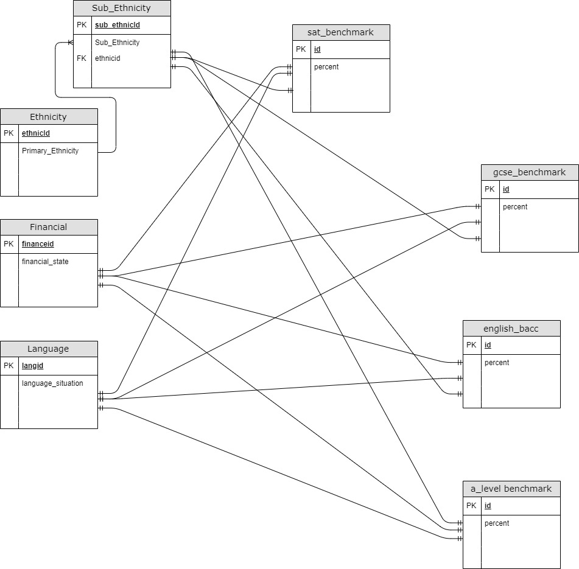

# Data Management and Analysis Project

## 1. Documentation

### Project Description

__TODO__: Add project description.
To Explore differences in educational performance distributions in the U.S. and U.K, by comparing distributions of GCSE
scores (in the UK) and SAT scores (in the US).

### Data Source or Description of Data 

A_Levels taken from:

GCSE data taken from:

SAT data taken from:

Data Consists of Pupil characteristics and the average percent of pupils with X characteristic that meet benchmark

### Field and / or Columns and Their Types

* id: `varchar(255)` - identifying value
* x_percent: `float` - float number representing that number of people who passed benchmark for x test

## 2. Diagram / Sample Documents and Collections

Ethnicity, Financial Situation, and Language Situation, each have their own code, that connects to an exam_benchmark table for multiple exams.

Ethnicity is filtered through a sub-ethnicity folder to take into consideration the UK has more detailed ethnic designations.

A-levels, GCSE, SAT scores have been modified into a csv that contains only the most relevant data.

A_levels :
[Ethnicity](a_levels_data/A_level_attaintment_characteristics_ethnicity.csv)
[Language](a_levels_data/A_level_attaintment_characteristics_language.csv)
[Financial](a_levels_data/A_level_attaintment_characteristics_financial.csv)

GCSE :
[Ethnicity](gcse_data/gcse_20152016_simplified_ethnicity.csv)
[Language](gcse_data/gcse_20152016_simplified_language.csv)
[Financial]((gcse_data/gcse_20152016_simplified_financial.csv)

SAT :
[Ethnicity](a_levels_data/A_level_attaintment_characteristics_ethnicity.csv)
[Language](a_levels_data/A_level_attaintment_characteristics_language.csv)
[Financial](a_levels_data/A_level_attaintment_characteristics_financial.csv)

## 3. Data Import and Collection... or Data Generation

__TODO__: Describe any data cleaning, preprocessing, etc. necessary to import data
No preprocessing neccessary
Run Scripts in this Order
[Create Table Script](create-tables.sql)
[Import Script](import-sql.sql)
[Use Cleanup Script to fix some data](cleanup.sql)
[Populate Table Script](populate.sql)

## 4. Analysis

Goal: To gain an understanding of the distribution of test scores between tests in the UK, and the U.S.
[Analysis Script](query.sql)
[CTE + View Location ](https://github.com/nyu-csci-ua-0480-003-fall-2019/JUCHY-mini-project/blob/d3616afed5e6262d793cead3e9c72a534df33566/query.sql#L12)

## 5. Research
Seaborn: statistical data visualization, used to visualize queries in a way that they make comparisons easier to understand

* __TODO__: Link to documentation / site of new concept or technology used
* __TODO__: Describe what you'll be using this technology for
* [__TODO__: Link to application of research in repository](name-of-some-file)

